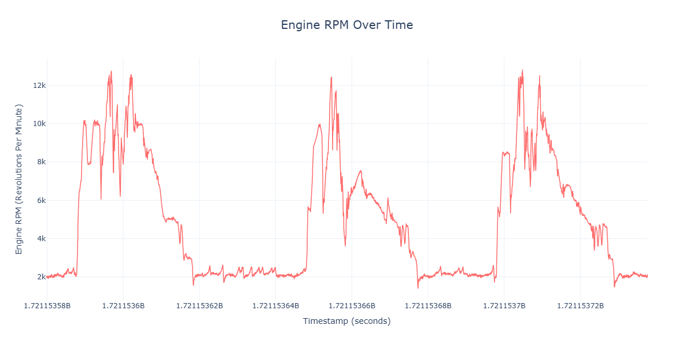
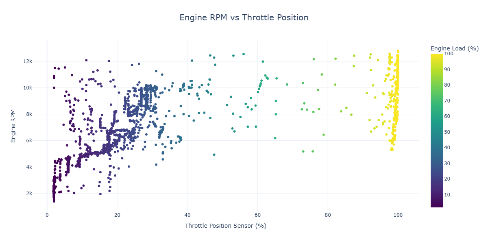
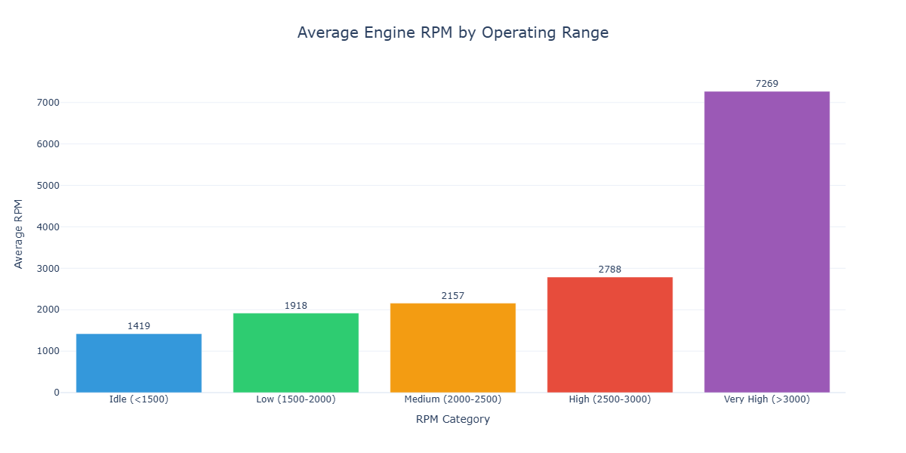
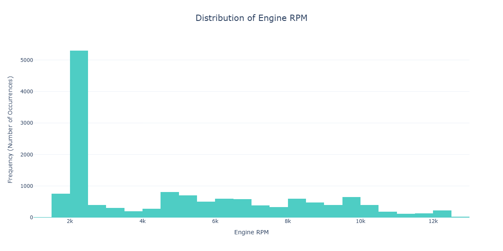
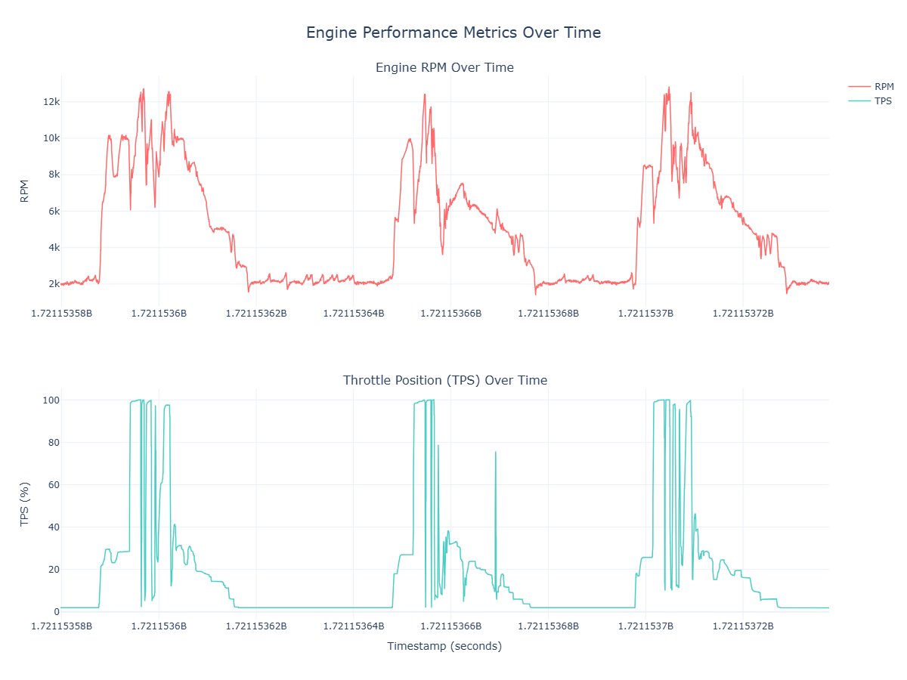

Nishanth Srinivasan  
2/13/26  
Python 3.11

# What my code does

1. Loads the CSV into a pandas DataFrame.
2. Cleans the data by:
   - Dropping the columns that never change.
   - Dropping rows that have `RPM` or `TPS` missing.
   - Removing duplicate timestamps.
3. Derives potentially useful values:
   - `Engine_Load_Percent` based on TPS.
   - `RPM_Category` buckets (Idle / Low / Medium / High / Very High).
   - A simple `Fuel_Efficiency_Index` (`Fuel Open Time / RPM`).
4. Visualizes the results with multiple graph types.

# Conclusions

- The dataset contained 4 dead Analog Input sensors, which were removed.
- RPM and TPS show a strong positive relationship(when throttle increases, RPM tends to increase).
- Most samples fall into the higher RPM range (above 3000 RPM), based on the RPM category distribution.

# Graphs

#1 RPM over time (Line)

#2 RPM vs TPS (Scatter)

#3 Average RPM by category (Bar)

#4 RPM distribution (Histogram)

#5 RPM + TPS over time (Multi-panel)

